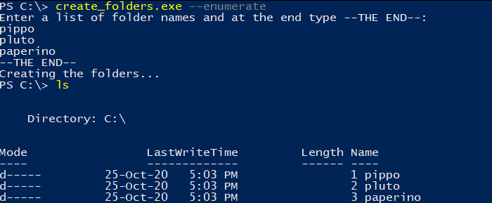

# Create folders

## Introduction

Many times you have to create a list of folders starting from a menù or a list of topics. The idea is to run an exe file from any folder on the PC and paste in the command window the folders name you want to create. An option to enumerate the folders would be handy 

## Software and Libraries

This project uses Python 3.11 and the following libraries:

* [pyinstaller](https://www.pyinstaller.org/)
* [argparse](https://docs.python.org/3/library/argparse.html)

## Local configuration

To setup a new local enviroment and install all dependencies you can run `.\my_scripts\Set-Up.ps1`. It will install:

* [Python](https://www.python.org/)
* [uv](https://docs.astral.sh/uv/)
* [Pre-commit](https://pre-commit.com/)

Pre-commit is a framework for managing and maintaining multi-language pre-commit hooks. A pre-commit hook is a script that runs before a commit operation in a version control system. This allows to shift left code quality checks and remediations. You can change the hooks by updateing the file `.pre-commit-config.yaml`.

To trigger the pre-commit hooks without an actual commit you can run `pre-commit run --all-files -v`.

## Testing

No test implemented.

## Build

To build the .exe file and place it in **%USERPROFILE%\AppData\Local\Programs\Python\Python311\Scripts** you have to run `deploy.cmd`

## Running the code

From any folder of your PC you can open a command promt and run `create_folders.exe`, then you have to paste the list of folder you want to create in the current folder. You can also use the `create_folders.exe --enumerate` to enumerate the folders and `create_folders.exe -h` to view the help

## List of activities

In the [TODO.md](TODO.md) file you can find the list of tasks and on going activities.

## Licensing and Acknowledgements

Have a look at [LICENSE.md](LICENSE.md).

## Outro

I hope this repository was interesting and thank you for taking the time to check it out. On my Medium you can find a more in depth [story](https://medium.com/@simone-rigoni01/) and on my Blogspot you can find the same [post](https://simonerigoni01.blogspot.com/) in italian. Let me know if you have any question and if you like the content that I create feel free to [buy me a coffee](https://www.buymeacoffee.com/simonerigoni).